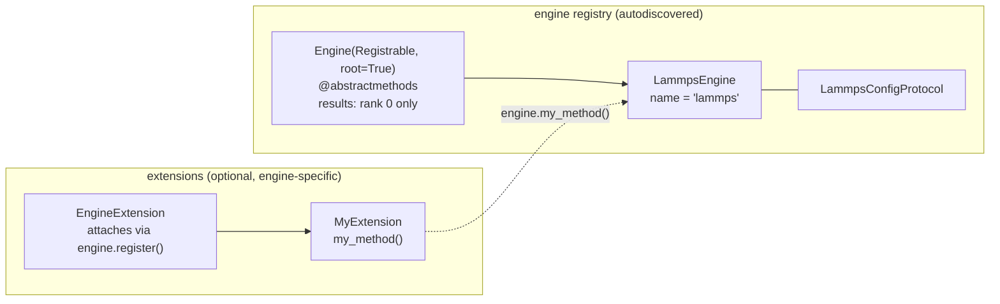

# Engine module

[TOC]

Engines are computational backends responsible for operations that require energy and force evaluations (e.g. minimization or event searches). The `Engine` module is designed to be used as the computation backend in the master-worker MPI structure provided by the `Manager` module _(see Manager documentation)_, and can also be used standalone. This primary use case within the Manager drives the key design choices of the module: `Engine` is a `Registrable` ABC with mandatory abstract methods, and data-extraction methods return results only on MPI rank 0 of the engine's communicator.

In addition to the mandatory interface, engines can be extended with operation-specific capabilities through the **extension mechanism** (see [EngineExtension](#engineextension) below). This is the intended integration point when a higher-level algorithm needs to delegate a specific computation to the engine directly, for example, a CNA filter that uses a LAMMPS compute instead of the default Python implementation.



## Details

### Engine ABC

`Engine` inherits from `Registrable` (with `root=True`), which provides the registry and the autodiscovery mechanism shared across pyKMC modules. All subclasses must declare a `name` attribute and implement every abstract method — these represent the minimal set of operations required for the simulation.

```python
from pykmc._core import Registrable
from abc import abstractmethod

class Engine(Registrable, root=True):

    @abstractmethod
    def start(self) -> None: ...           # start the engine, must be called first

    @abstractmethod
    def close(self) -> None: ...           # shut down and free resources

    @abstractmethod
    def initialize_parameters(self) -> None: ...   # set units, dimension, pbc, etc.

    @abstractmethod
    def initialize_system(self, types, positions, cell, pbc) -> None: ...

    @abstractmethod
    def initialize_potential(self) -> None: ...

    @abstractmethod
    def get_positions(self) -> np.ndarray | None: ...

    @abstractmethod
    def set_positions(self, positions: np.ndarray) -> None: ...

    @abstractmethod
    def get_total_energy(self, positions=None, recompute=True) -> float | None: ...

    @abstractmethod
    def get_potential_energy(self, positions=None, recompute=True) -> float | None: ...

    @abstractmethod
    def minimize(self, positions=None) -> None: ...

    @abstractmethod
    def minimize_with_results(self, positions=None) -> tuple[np.ndarray, float] | None: ...
```

**Rank 0 convention.** When running under MPI, all engine commands execute collectively across all ranks, but data-extraction methods (`get_positions`, `get_total_energy`, `get_potential_energy`, `minimize_with_results`) return values only on rank 0 — all other ranks return `None`. Code calling these methods must account for this:

```python
result = engine.minimize_with_results(positions)
if result is not None:   # rank 0 only
    positions, energy = result
```

### Config Protocol

Each engine declares its own configuration interface as a `Protocol`. This keeps the engine decoupled from any concrete config class: it only requires that the config object exposes the expected attributes, without enforcing how it is built. In practice pyKMC uses Pydantic `BaseModel`s as configs, which are structurally compatible with any matching `Protocol`. The engine can therefore be instantiated with a Pydantic model in production or a plain stub in tests, as long as the interface matches.

```python
from typing import Protocol

class MyEngineConfig(Protocol):
    pair_style: str
    pair_coeff: str
    min_style: str
    minimize: str
    verbosity: int
```

### EngineExtension

`EngineExtension` allows attaching engine-specific operations to an engine instance without modifying the `Engine` ABC. An extension registers itself at construction time by calling `super().__init__(engine)`, which calls `engine.register(self)` and stores the engine reference as `self.engine`. The engine then exposes the extension's public methods directly through `__getattr__` delegation, so callers access them as if they were native engine methods.

```python
from pykmc.engine import EngineExtension, Engine

class MyCNAExtension(EngineExtension):
    def __init__(self, engine: Engine, cutoff: float):
        super().__init__(engine)   # required — registers on the engine
        self.cutoff = cutoff

    def compute_cna(self, positions) -> list:
        # self.engine gives full access to the engine (e.g. self.engine.lmp for LAMMPS)
        ...
```

Once attached, the method is accessible directly on the engine instance:

```python
engine = LammpsEngine(config=cfg)
MyCNAExtension(engine, cutoff=3.5)   # attaches on construction

result = engine.compute_cna(positions)   # delegates to the extension
```

Conflicts are caught at registration time: if two extensions expose a method with the same name, `register()` raises a `ValueError`.

### Distinction from strategies

Although `Engine` uses the same `Registrable` autodiscovery mechanism as strategies, the two serve fundamentally different roles. Strategies are interchangeable algorithmic choices for a given operation; engines are fixed computational backends. An engine is not selected as one option among many equivalent alternatives — it is the substrate on which strategies run.

> **Naming convention**: concrete engine classes use the `Engine` suffix (e.g. `LammpsEngine`). This signals that the class is a backend implementation, not an algorithmic strategy. Both inherit from `Registrable`, but the philosophy is strictly different.

## Adding a new engine

**1.** Create `pykmc/engine/my_engine.py`.

**2.** Define a config Protocol and an engine class:

```python
from typing import Protocol
import numpy as np
from .base import Engine

class MyEngineConfig(Protocol):
    my_param: str

class MyEngine(Engine):
    name = "my_engine"

    def __init__(self, config: MyEngineConfig, comm=None, engine_id: int = 0):
        super().__init__()
        self.config = config
        self.comm = comm
        self.engine_id = engine_id

    @property
    def _is_rank0(self) -> bool:
        return self.comm is None or self.comm.Get_rank() == 0

    def start(self) -> None: ...
    def close(self) -> None: ...
    def initialize_parameters(self) -> None: ...
    def initialize_system(self, types, positions, cell, pbc) -> None: ...
    def initialize_potential(self) -> None: ...
    def get_positions(self) -> np.ndarray | None: ...
    def set_positions(self, positions) -> None: ...
    def get_total_energy(self, positions=None, recompute=True) -> float | None: ...
    def get_potential_energy(self, positions=None, recompute=True) -> float | None: ...
    def minimize(self, positions=None) -> None: ...
    def minimize_with_results(self, positions=None) -> tuple | None: ...
```

No other steps are needed. `autodiscover` imports all submodules of `pykmc/engine/` when the package is loaded, which triggers `Registrable.__init_subclass__` and registers `MyEngine` under `"my_engine"` automatically.

## Adding a new extension

**1.** Create the extension class, typically alongside the strategy that needs it or in a dedicated file:

```python
from pykmc.engine import EngineExtension, LammpsEngine

class MyExtension(EngineExtension):
    def __init__(self, engine: LammpsEngine, my_param: float):
        super().__init__(engine)   # required
        self.my_param = my_param

    def my_method(self, positions) -> float:
        # self.engine gives access to the full engine (e.g. self.engine.lmp)
        ...
```

**2.** Attach the extension when building the object that needs it:

```python
engine = LammpsEngine(config=cfg, comm=comm)
MyExtension(engine, my_param=1.5)   # registers on construction

# from here, engine.my_method(...) works transparently
```

The extension does not need to be registered anywhere else. The `EngineExtension.__init__` call handles the attachment entirely.
