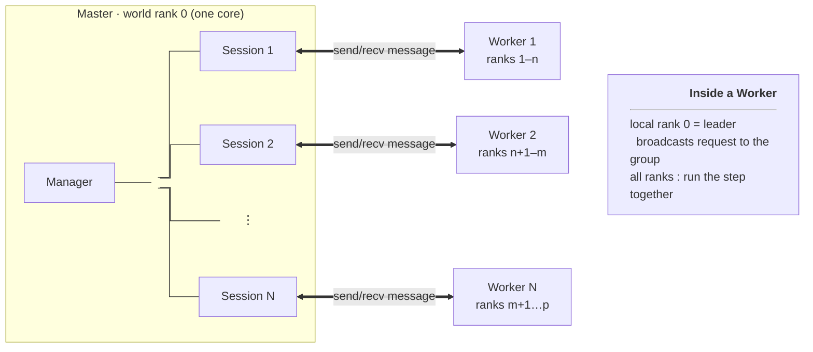
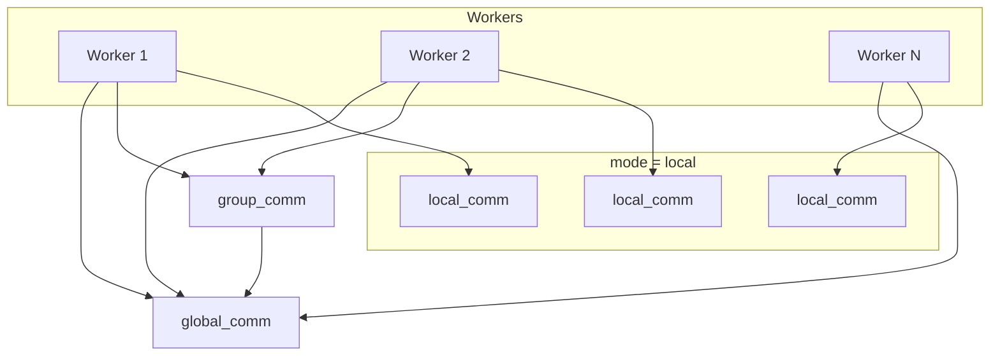
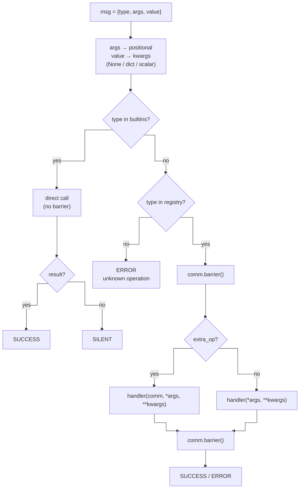

# Parallelization - Manager

Due to the inherent KMC algorithm, pyKMC is mostly sequential. However, some heavy operations are independent (e.g. event searches and refinements) and can be parallelized. The `manager` module provides a standard MPI master-worker architecture for this purpose.

While the module can be used standalone, its design is driven by pyKMC's specific needs. Typically, this architecture is used to run multiple `Engine` instances operating independently, one per worker, each on a small number of cores.

Beyond this basic use, the architecture addresses two problems specific to pyKMC:

(i) Collective operations on the full system: each worker normally runs a "small" `Engine` instance operating on a subset of atoms (with active volumes). When a whole-system operation is needed (e.g. minimization), performing it on one of these small instances is inefficient for large systems. The manager addresses this by allowing an additional Engine instance to be instantiated collectively across multiple workers, so that the operation can exploit available cores.

(ii) Pure Python parallelism: some operations are worth parallelizing but do not require an Engine at all. The manager provides a mechanism for all workers to execute Python functions synchronously, communicating via MPI.

We first describe the manager module and then how it is ment to be used in pyKMC with the `Engine` module. 

## Structure 

The `manager` module provides three components meant to be used together: a `Manager` object, which is the user-facing interface for submitting operations, a `Session` object, which handles communication between the `Manager` and a single `Worker`, and a `Worker` object, which implements the logic to broadcast and dispatch MPI requests across all ranks of its local communicator.




To support all three use cases, the `Manager` relies on several MPI communicators: one `local_comm` per worker (spanning only that worker's ranks), a `group_comm` spanning a subset of workers, and a `global_comm` spanning all workers. A separate `world_comm` (typically `MPI.COMM_WORLD`) is reserved for rank-0-to-worker communication via the `Session` protocol. Whenever the mode changes, switching commands (`use_local`, `use_group`, `use_global`) are sent through `world_comm` to update the active communicator on each worker.




Setting up these communicators and wiring the components together is handled by a `ManagerFactory`, described bellow to facilitate its use. 

## Modes 

#### Local mode

The default mode. Operations are asynchronous and follow a standard master-worker pattern: each call creates a `Job` holding the operation name, its arguments, and a `Future` result, then places it in a shared queue. Each `Session` thread picks up jobs as they become available and executes them on its worker.

Usage : 
```python
future = manager.operation(parameter=a)   # non-blocking, returns immediately
# ... other work ...
result = future.result()                   # blocks until the job completes
```

The `Job` dataclass:
```python
@dataclass
class Job:
    op_name: str
    kwargs: dict
    args: tuple
    future: Future
```

#### Group mode

Group mode is synchronous. The operation is dispatched to `Session` connected to the group communicator, and all workers in the group execute it collectively. The call blocks until the operation completes.

Usage :
```python
result = manager.group_operation(parameter=a)  # blocking
```

Workers outside the group remain idle for the duration of the call.

#### Global mode

Identical to group mode, but the operation runs collectively across all workers.

Usage:
```python
result = manager.global_operation(parameter=a)  # blocking
```

Mode switches happen automatically: calling `manager.group_operation()` while in local mode drains the local queue first, then switches to group mode. Calling any local operation switches back. Same for the global mode.

## Available Operations 

The `Manager` submits by name, the `Session` forwards the request, and the `Worker` looks up the matching callable at dispatch time and runs it on every rank of the active communicator.

Each `Worker` maintains a registry, a dictionary mapping operation names to `Callables`. When a message arrives from rank 0, the worker looks up the operation name in its registry and calls the corresponding function.

Each mode has its own registry (`local_registry`, `group_registry`, `global_registry`), built at construction time and swapped when the mode changes. The set of available operations can therefore differ between modes.

In addition to the user-defined registry, the `Worker` exposes a set of builtin operations (`use_local`, `use_group`, `use_global`, `shutdown`, `list_ops`) that are always available regardless of mode and are dispatched before the registry is consulted.

A `Worker`'s registry is assembled at construction from three sources:

1. Object methods (`local_obj`, `global_obj`, `group_obj`): `build_registry` collects, via `inspect.getmembers`, all public methods. Passing a list of objects merges their methods, a duplicate name raises `ValueError`. Object methods are called with kwargs only (no communicator is injected) so each object must already hold its communicator as an attribute, set at construction.
2. extra_ops: MPI-aware callables with signature `fn(comm, *args, **kwargs)`. The `Worker` injects the active communicator at dispatch time, so the same function adapts automatically to whichever mode is current.
3. Builtins: `use_local`, `use_group`, `use_global`, `shutdown`, `list_ops`. Always available, handled separately from the registry.

## Message format and dispatch

A message starts at the `Manager`: a submit call (or one of its group_ / global_ variants) hands the operation to a `Session`, the object that actually talks to the worker. From there the `Session`, on world rank 0, sends it point-to-point over `world_comm` to the worker's master rank, the local rank 0 of the active communicator. That rank is the only one reading world_comm, the other ranks are blocked in a collective, waiting. Once the master rank has the message, it broadcast it over the active communicator so that every rank holds the same message, and then all ranks dispatch it together. The operation is performed and the return value (or error) travels back the other way: only the master rank replies to the `Session`, over `world_comm`, which hands it back to the `Manager`.

A message has the shape `{"type": <op_name>, "args": <positional payload>, "value": <payload>, "reply": <bool>}`. The `reply` field defaults to `True`; `Session._send_command` sets it to `False` for the fire-and-forget builtins (mode switches, shutdown) so that no status is emitted for a caller that is not waiting. The `args` field (omitted when the caller passed no positional arguments) is forwarded as positional arguments, ahead of the kwargs. The `value` field becomes kwargs by the following rule:

- absent or `None` → no kwargs;
- `dict` → used as-is as kwargs;
- scalar → wrapped as `{"value": scalar}`.

In practice `Session.call(op, *args, **kwargs)` always sends a `dict` (or nothing) as `value`, but `_dispatch` handles the scalar case to stay robust against other senders.

Dispatch distinguishes two categories:

- Builtins : executed inside the same error boundary as registry operations but without a barrier, since they only mutate the worker's local state (mode switch, shutdown). They return `SILENT` unless they produce a value (`list_ops` returns a list → `SUCCESS`). Whether a reply is sent is decided by the sender, not by the return value: see the `reply` field above.
- Registry operations : bracketed by a `comm.barrier()` before and after, so that internal MPI collectives are safe. `extra_ops` receive `self.comm` as their first positional argument, followed by the caller's `args`; object methods receive the caller's `args` directly. Both then receive the kwargs. An unknown name returns `ERROR` with the list of available operations.




### The dispatch result

`_dispatch` runs on every rank and returns a `DispatchResult` (dataclass) carrying a `DispatchStatus` (enum) plus an optional value and error:


```python
class DispatchStatus(Enum):
    SILENT  = "silent"
    SUCCESS = "success"
    ERROR   = "error"

@dataclass
class DispatchResult:
    status: DispatchStatus
    value:  Any = None
    error:  str | None = None
```

These types never cross `world_comm`, they only tell the master rank whether to reply, and with what:

- `SILENT` : the operation produced no value. A message sent fire-and-forget (`"reply": False`, used by `Session._send_command` for mode switches and shutdown) gets no reply at all; a message sent through `Session.call`, which always waits, still gets a void status so the caller is released.
- `SUCCESS` : send a `status` message, then a `result` message only if `value is not None`. 
- `ERROR` : send a `status` message carrying the error string, no result follows.

Every rank produces a `DispatchResult`. After a registry operation the ranks of the active communicator `gather` their error field, so a failure on any rank — not just the master — is reported to the caller; only local rank 0 then sends the reply (in `_send_result`), and only when the incoming message asked for one. 
### Reply and tags

Only local rank 0 replies to the `Session`, over `world_comm`. It first sends the status message (`has_result` flag + optional `error`), then, if `has_result` is true, a second result message with the return value. On the `Session` side an `error` is re-raised as `RuntimeError`, otherwise the value is returned to the caller (or `None` when there is no result).

The two directions use three tags to keep the flows from interleaving on `world_comm`:

```python
_TAG_STATUS = 0   # Worker → Session : completion + error flag
_TAG_RESULT = 1   # Worker → Session : return value (only if has_result)
_TAG_CMD    = 2   # Session → Worker : operation request
```

The numeric values are arbitrary, the only invariant is that both sides agree on them. A new message flow should get a new tag rather than overload an existing one.

Notes :
- `return None` means "void" : the `has_result` flag is computed from `r.value is not None`. An operation that legitimately returns `None` is treated as having no result, and `Session.call` returns `None` without waiting for a `result` message.
- `extra_ops` signature : they must accept the communicator as their first argument (`fn(comm, *args, **kwargs)`), unlike object methods.
- Reserved names : the builtins (`use_local`, `use_group`, `use_global`, `shutdown`, `list_ops`) cannot be reused by a method or `extra_op`.
- Cross-mode consistency : Objects passed to the different modes must expose the same public methods, otherwise construction fails.

## Factory 

A `ManagerFactory` is provided to facilite the use of the `Manager`. It is the collective entry point that wires the `manager` stack together. A single `launch()` call partitions the MPI ranks, builds the communicators, instantiates `Workers`, and assembles the `Session` objects and the `Manager`.

```python 
self.manager = ManagerFactory(
            obj_factory=lambda comm, _: Object(comm),
            n_workers=4,
            comm=comm,
            has_global=True,
            group_size=6,
            extra_ops={"extra_operation": extra_operation},
        ).launch()
``` 

Rank 0 is always the `Manager` and runs no worker. Ranks `1 … size-1` are split into `n_workers`.  Then, the provided comm is split, with `comm.Split`, so :

- `local_comm` : one per worker;
- `global_comm` : all worker ranks (if `has_global`);
- `group_comm` : subset of workers (if `group_size` is set), `group_size` must be a multiple of the per-worker rank count, checked at construction.

Object creation is delegated to `obj_factory(comm, mode) -> Any | None`, called once per (worker × mode), the result is registered in the worker's registry for that mode. Returning `None` leaves the mode holding only `extra_ops`. An MPI-aware object must be initialized with the communicator it is handed. `extra_ops` pass through to every worker unchanged.

`launch()` is collective : every rank calls it. On a worker rank it builds the `Worker` and calls `worker.start()`, which blocks in the message loop until `shutdown` (returns `None`). On rank 0 it builds the sessions and `Manager`, calls `manager.start()`, and returns it, so everything after `factory.launch()` is rank-0 driver code while the workers are already looping inside it.

## Engine factory 

`EngineManagerFactory` is the pyKMC-specific subclass of `ManagerFactory`. It fixes the object-creation policy to the pyKMC convention: one `Engine` per worker for local mode, plus one shared `Engine` on the group, so you supply an engine style and config instead of an `obj_factory`. 

```python 
factory = EngineManagerFactory(
    engine_style="lammps",
    engine_config=cfg,
    n_workers=4,
    group_size=8,        
    comm=MPI.COMM_WORLD,
).launch() 
```

The subclass overrides `_create_worker` to attach engines by mode: local gets one engine per worker on its `local_comm`, the asynchronous path, each worker running an independent engine on a small active volume, group gets a single engine built collectively on `group_comm` and shared across the group's workers, the synchronous path for whole-system operations, global gets no engine (`None`) and is reserved for `extra_ops`.

A whole-system operation (e.g. a full minimization) run on one worker's small engine is inefficient for large systems. Group mode lets that operation span several workers' cores instead, and `group_size` sets how many: small systems can use a small group, large systems get more cores by raising it.
