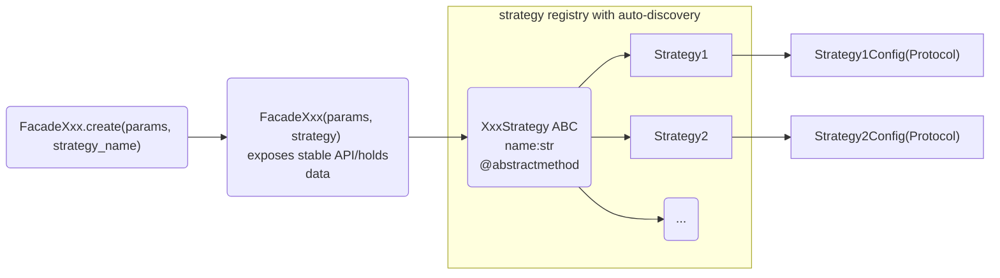

# Facade/pluggable strategy architecture

_Note: refactoring in progress. Objects marked "todo" below still need to be migrated to this architecture._

[TOC]

pyKMC relies on several objects to perform specific tasks:

- `NeighborsList` _(todo)_
- `AtomicEnvironments` _(todo)_
- `ReferenceTable` _(todo)_
- `ActiveTable` _(todo)_
- `RateConstant` _(todo)_
- `PSR` _(todo)_
- `EventSearch` _(todo)_
- `Refinement` _(todo)_
- `Basin` _(todo)_

These tasks are independent of the main KMC loop, and each of them can have multiple valid implementations. For example, atomic environments can be represented using graphs or descriptors, event search can rely on the Activation Relaxation Technique or the dimer method. Implementations may also depend on different tools, for example, computing a common neighbor analysis could use the pure Python implementation in pyKMC, or delegate directly to LAMMPS when it is the active engine. In the following, we refer to each such implementation as a **strategy**.

Currently, most of these objects only expose a single strategy, but the architecture was designed from the start with extensibility in mind, to facilitate testing, and to allow users to plug in their own implementations.

To that end, pyKMC uses a **facade/strategy pattern** built around two components:

- A **facade** object, which is the user-facing API. It holds the relevant data and exposes a stable interface, regardless of which strategy is active underneath. It also provides a convenient create classmethod that reads the configuration, builds the requested strategy, and returns a wired facade.
- A **strategy** object, which inherits from an abstract base class (ABC) and implements the specific method. Swapping strategies does not affect the facade's interface.



## Details 
### Facade 

The facade itself never contains computation logic. It only stores the data it needs, holds a reference to the strategy, and delegates:

```python 
class Facade:
    def __init__(self, params, strategy: XxxStrategy) -> None:
        self.params = params
        self._strategy = strategy

    def some_compute(self, **kwargs) -> ResultType:
        return self._strategy.some_compute(**kwargs) 
        
    @classmethod 
    def create(cls, params, strategy: str, **kwargs) -> "FacadeXxx": 
	    return cls(param, strategy=StrategyXxx.create(strategy, **kwargs))
``` 

This separation has two practical benefits. First, adding or modifying a strategy never risks breaking the user-facing interface. Second, the facade can be tested independently of any specific strategy implementation. A `create` classmethod is the convenience constructor that builds the strategy and wires it, in practice : 

```python 
obj = Facade.create(params, strategy="my_strategy", config=cfg)
```

### Strategy 

A strategy inherits from the module's abstract base (declared with `root=True`) and implements the required abstract methods. The `name` attribute identifies it in the registry and is validated at class-definition time via `__init_subclass__`. All the plumbing lives once in `pykmc/_core/registrable.py` (via the `Registrable` base class) and is reused by every module.

Each strategy declares its own configuration as a `Protocol`. This keeps the strategy decoupled from any concrete config class: it only requires that the config object exposes the expected attributes, without enforcing how it is built. In practice pyKMC uses Pydantic `BaseModel`s as configs, which are structurally compatible with any matching `Protocol`. The strategy can therefore be instantiated with a Pydantic model in production, or with a plain dataclass / stub in tests, as long as the interface matches.


```python 
from pykmc._core import Registrable
from abc import abstractmethod
from typing import Protocol

class XxxStrategy(Registrable, root=True): 
    @abstractmethod
    def some_compute(self, **kwargs) -> T:
        pass
        
class MyStrategyConfig(Protocol): 
    my_param1: float 
    my_param2: str 
	
class Strategy1(XxxStrategy): 
    name = "my_strategy" 
	
    def __init__(self, config: MyStrategyConfig) -> None: 
        self.config = config 
		
    def some_compute(self, **kwargs) -> T: 
        ...
```

> **Naming convention**: the `XxxStrategy` suffix signals that a class's concrete subclasses are interchangeable algorithm implementations. It is a convention, not a base class, the technical plumbing comes entirely from `Registrable`. Non-algorithmic backends (e.g. `Engine`) also inherit from `Registrable` directly.

### Strategy registry 

Each module base keeps a registry mapping `name` to strategy class. A strategy adds itself to it when its class is defined in a file in  `<module>/strategies/`.
The files must be imported, `autodiscover` does that in one line per module :

```python
# pykmc/<module>/strategies/__init__.py
from pykmc._core import autodiscover
from .base import XxxStrategy

XxxStrategy._import_errors = autodiscover(__name__, __path__)
```

- It works at any inheritance depth. If you add an intermediate base to share code, its concrete children still register
- Each module has its own registry (`root=True`), so the same name in two modules never clashes.

## Adding a new strategy

**1.** Create `pykmc/my_module/strategies/my_strategy.py`

**2.** Define a config protocol and a strategy class:

```python
from typing import Protocol
from pykmc._core import Registrable
from .base import XxxStrategy  # XxxStrategy(Registrable, root=True) défini dans base.py

class MyStrategyConfig(Protocol):
    my_param: float

class MyStrategy(XxxStrategy):
    name = "my_strategy"

    def __init__(self, config: MyStrategyConfig) -> None:
        self.config = config

    def some_compute(self, **kwargs) -> float:
        ...
```

No other steps, `autodiscover` imports the new module, `__init_subclass__` registers it under `"my_strategy"`, and `Facade.create(params, strategy="my_strategy", config=cfg)` works immediately.
