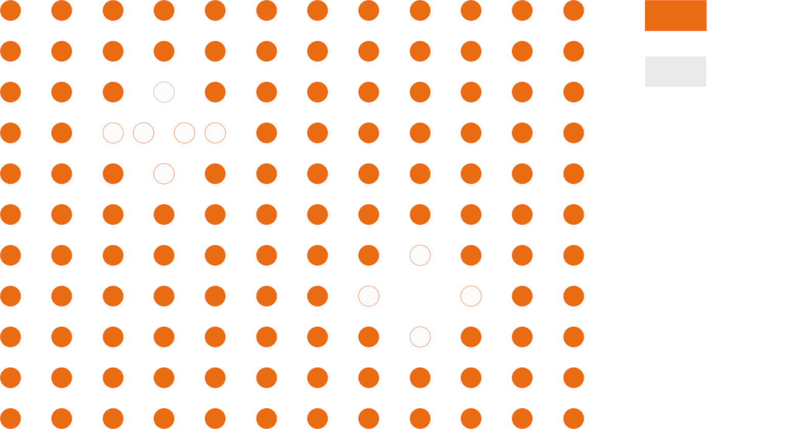
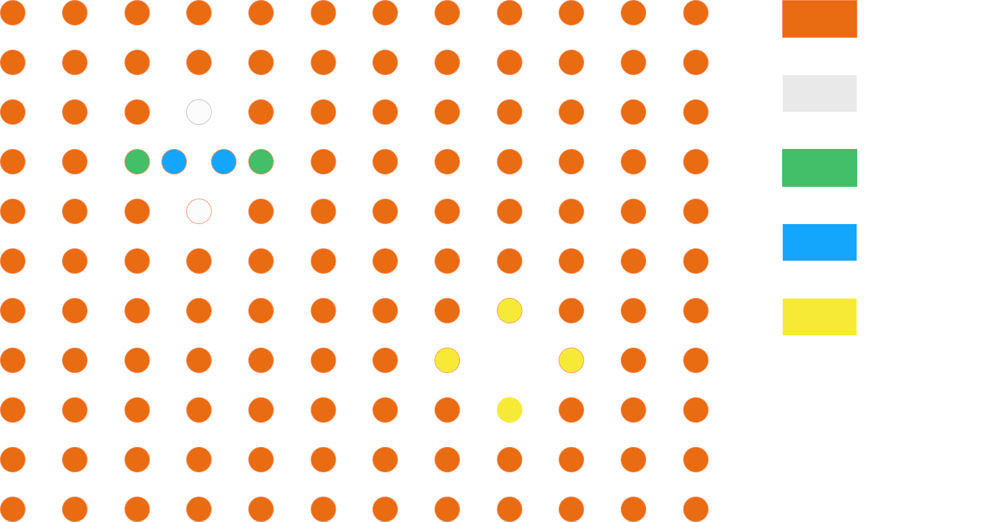
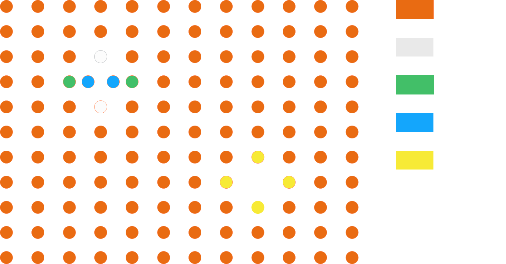
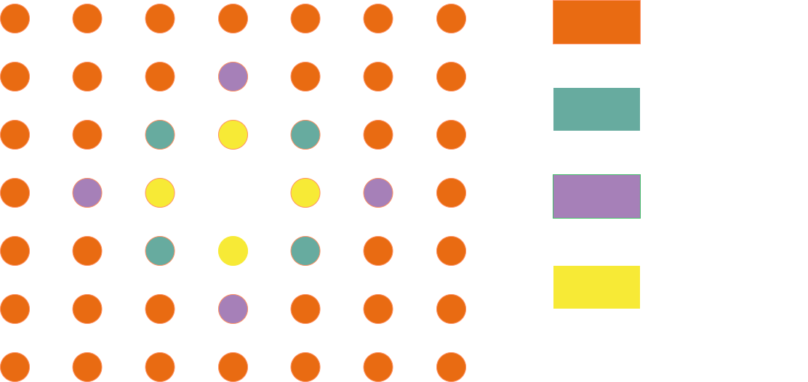
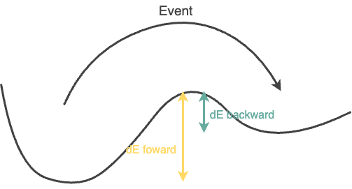

# User Guide 

_This is a temporary user guide that aim to provide basic information on the simulation workflow and how to choose simulation's parameters_ 

pyKMC is an on-the-fly kinetic Monte Carlo (KMC) program.

At each step, if a new atomic environment is encountered, pyKMC performs event searches and adds the resulting generic events to a reference event table.
When a previously visited environment is found again, pyKMC refines the stored reference events to account for elastic deformations, and builds an active event table specific to the current state.

An event is then selected from this active table based on the chosen KMC algorithm and applied to the system, advancing the simulation.

To start a simulation, pyKMC requires a configuration file in the INI format. This file contains general simulation parameters, as well as tool-specific settings needed to run the different stages of the simulation workflow. 

## Control 

The first section of the INI configuration file, called [Control], defines general simulation parameters.
You must provide an initial atomic configuration file, readable by ase.io.read, which includes atomic positions, cell parameters, and periodic boundary conditions (PBC). For example, if using an XYZ file, it should look like:

```bash 
2047
Lattice="28.16 0.0 0.0 0.0 28.16 0.0 0.0 0.0 28.16" pbc="T T T"
Ni       0.00000000       0.00000000       0.00000000       
Ni       0.00000000       1.76000000       1.76000000       
... 
``` 
The path to this file should be provided using the `initial_config` key. 
You must also specify : 
- the number of KMC steps to run with `n_steps`
- the simulation engine to use to compute energy, forces and perfrom event searches/refinements (e.g., lammps) with the `engine` key

A minimal example of a `[Control]` section would be:
```INI 
[Control] 
initial_config = myconfig.xyz 
n_steps = 100 
engine = lammps
``` 
Additional options in this section allow you to customize output filenames (see the full parameter documentation).
pyKMC also saves the reference event table and the list of visited environments as .pickle files. To reuse them in a new simulation, simply provide their paths:

```INI 
reference_table = my_reference_table.pickle 
visited_environments = my_visited_environments_list.pickle
```  
Alternatively, you may provide only a list of visited environments if you wish to exclude certain environments from being explored.

## Engine 

The INI configuration file must also include a section specific to the engine you selected in the `[Control]` section.
For example, if you set `engine = lammps`, your file should include a `[Lammps]` section.

### Lammps 

When using LAMMPS, you need to specify the potential parameters.
Currently, only pair potentials are supported. You must provide the `pair_style` and `pair_coeff` keys

Additionally, you can change default parameters used during system minimization (see the full parameter documentation). 

A minimal `[Lammps]` section might look like:
```INI 
[Lammps]
pair_style = eam/alloy 
pair_coeff = * * my_file.eam Ni 
``` 

## Atomic Environment 

During the simulation, at each step, pyKMC assigns an atomic environment ID to every atom in the system.
This ID serves as a unique fingerprint of the atom’s local environment, allowing pyKMC to identify recurring configurations.

Each reference event is also tagged with an environment ID, corresponding to the initial local configuration of the event’s central atom—the atom that moves the most during the transition. For the event, their ID are always computed based on graph (see below).

To determine whether a stored reference event can be reused, pyKMC compares the event's environment ID with those computed in the current system.

Different ID generation strategies (called styles) are available to define atomic environments. 

To define parameters related to the generation of those IDs, the INI configuration file should contains a `[AtomicEnvironment]` section. 

The two main parameters are specified by the `rnei` and `rcut` keys. `rnei` defines the first nearest neighbors of an atom. Atoms within this distance are considered direct neighbors. `rcut`defines the atomic environment sphere, atoms in this sphere are part of the local atomic environment. 

You can select the method (or style) used to assign an atomic environment ID to each atom.
The available styles are:
- cna : 
In this mode, pyKMC counts the number of neighbors around each atom and checks whether it matches a typical crystalline coordination number (6, 8, or 12).
    - if the atom has one of these neighbor counts, it is labeled "crystal".
    - Otherwise, it is labeled "noncrystal".
This style should be only use when setting in the `[Control]` section `reconstruction = False`. (_Not working anymore for the moment_).
<div style="display: flex; align-items: center; justify-content: center; gap: 20px;">
  
  <div style="text-align: center; font-weight: bold;">
    Using style=cna gives: 
  </div>
  
</div>

- graph : 
In this style, pyKMC constructs a graph from each atom's environment using pyNauty. 
A unique, canonical certificate (a binary) is then computed using pyNauty, serving as the atom’s environment ID.
<div style="display: flex; align-items: center; justify-content: center; gap: 20px;">
  
  <div style="text-align: center; font-weight: bold;">
    Using style=graph gives: 
  </div>
  
</div>

- cna/graph : 
In large systems, many atoms are in a perfect crystalline environment. Computing graph-based IDs for all of them is inefficient.
This hybrid mode provides a compromise: 
    - First, a CNA classification is performed. 
    - If an atom is labeled "crystal", it keeps this simple ID. 
    - If it is labeled "noncrystal", a graph-based ID is computed. 
<div style="display: flex; align-items: center; justify-content: center; gap: 20px;">
  
  <div style="text-align: center; font-weight: bold;">
    Using style=cna/graph gives: 
  </div>
  
</div>

When searching for an event around a "noncrystal" atom, it may happen that another atom ends up being the one that moves the most. In this case, the resulting event will be tagged with the graph ID of that other atom.
If this ID corresponds to a "crystal" atom in the current system, that event will never be selected. 

To avoid this issue, you can instruct pyKMC to expand the graph style to the nth neighbors of the "noncrystal" atom using the `neighbors_add` key. 

For example, when looking at a vacancy with `neighbors_add = 1` it will gives : 

<div style="text-align: center;">

</div>

Finally, the `[AtomicEnvironment]` section of the INI configuration file will look like this : 
```INI 
[AtomicEnvironment] 
style = cna/graph
rnei = 3.0 
rcut = 6.5 
neighbors_add = 1 
``` 
## Event Search : 

The `[EventSearch]` section lets you define:
- the algorithm used to search for new events,
- the criteria used to keep or discard events in the reference event table,
- if a refinement is successful.

This section requires two mandatory keys:
- `style` : the algorithm used to perform event searches. _Currently, only partn is supported._
- `nsearch` : number of event searches to perform per atomic environment.

A minimal configuration looks like:
A `[EventSearch]` section in the INI configuration file is typically : 
```INI 
[EventSearch] 
style = partn 
nsearch = 50 
``` 

When an event is found, it is characterized by two energy barriers, a foward energy barrier $dE_{foward}$ and an inverse energy barrier $dE_{backward}$ : 
<div style="text-align: center;">
  
  <div style="font-size: 0.9em; color: gray; margin-top: 5px;">
    Potential energy surface</code>
  </div>
</div>

The event is added to the reference table only if it satisfies all the following conditions:

- $dE_{foward}$ < `emax_event` 
- $dE_{foward}$ > `emin_event` 
- $dE_{backward}$ > `emin_event` 
- the event is not highly asymmetric: it is rejected when $dE_{forward}$ > `energy_asymmetry` x `backward_emin_event` while $dE_{backward}$ < `backward_emin_event`

Once a reference event is reused, it is refined to adapt to the current atomic configuration. The refinement is considered successful if:
- The central atom moves less than `refined_minimum_delr_thr` between the current position and the refined minimum.
- The difference in energy barriers between the generic and refined events is less than `refined_energy_thr`.
These thresholds ensure that the refined event remains consistent with the original.

Not every applicable reference event is sent to the refinement engine; the others enter the
active table with their generic saddle (`refined = F`). Which ones are refined is governed by
`refine_thr` in `[Control]` and depends on the rate-constant style:

- `style = constant`: the fastest reference event whose rate lies below `refine_thr` times
  the estimated total rate fixes a barrier threshold (its barrier + 0.1 eV); events above it are
  not refined. Event/atom pairs still present in the active table are skipped.
- `style = htst` or `rpa`: `refine_thr` is a cumulative pre-dispatch rate coverage. Before
  anything is dispatched, pyKMC builds a candidate ledger of the retained active events (their
  current rate, once each) and of every reference event that matches a current site (its
  resolved reference or `k0` rate, one entry per symmetric application), sums the
  contributions per reference event, ranks the groups by decreasing rate and selects them until
  the running sum reaches `refine_thr` times the ledger total (groups tied at the cut are
  included; `refine_thr = 1` selects every group with a positive rate). Only the selected groups
  are refined, including retained unrefined pairs; already refined retained events are never
  refined again; a retained unrefined row is superseded only by the refinement of its own
  application (matched by saddle geometry), never by a sibling's. The log reports the ledger
  (`refinement ledger:`), the selected fraction, the fraction actually refined and the shortfall
  (failed refinements and selected retained rows that could not be re-refined this step)
  (`refinement coverage:`), also on the per-step `HTST prefactors:` summary line. The fractions
  describe the pre-dispatch ledger; refined and site-specific rates that arrive later change
  the next step's ledger, never the reported one.

To further control the behavior of the selected event search algorithm (style), you must define a separate section matching the algorithm name. For instance, if you choose `style = partn` you must also include a `[pARTn]` section in your INI file to configure specific parameters for the pARTn method. 

### pARTn : 

All other parameters have default values (see the full parameter documentation), but depending on your system, you may need to adjust some of them for optimal performance.
Parameters related to refinements are prefixed with r_

A minimal `[pARTn]` section will look like this : 
```INI 
[pARTn] 
delr_thr = 0.1
r_eigval_th = -0.02
```

For a detailed explanation of the pARTn algorithm and its parameters, please refer to the official pARTn documentation.

## Rate Constant 

Each time an event is added to either the reference or the active event table, a rate constant is computed from the Arrhenius law

$$
k = \nu_{0} \, e^{-\frac{dE_{forward}}{{k_{b}T}}}
$$

where $dE_{forward}$ is the forward energy barrier, $T$ the temperature defined by the user and $k_{b}$ the Boltzmann constant. The `[RateConstant]` section selects how the prefactor $\nu_{0}$ is obtained (`style`); all parameters are in LAMMPS metal units.

- `style = constant`: $\nu_{0} = k_{0}$, a user-defined pre-exponential factor in ps$^{-1}$ (typically $10^{13}\,s^{-1} = 10\,ps^{-1}$).
- `style = htst`: every accepted reference event gets the harmonic-transition-state-theory (Vineyard) prefactor computed from the partial Hessians of its two minima and its saddle over the free region (`free_radius` around the moving atom, centred on the saddle by default, see `free_region_center`), optionally on a cropped scratch system (`zone_radius`) and after a preminimisation (`premin`). Refined active events get their own site prefactor from the refined saddle. This style needs a LAMMPS build with the `PHONON` package (the `dynamical_matrix` command): its absence is a preflight error when the simulation starts, there is no finite-difference fallback in production.
- `style = rpa`: an alias of `htst` (bare Vineyard prefactor; no recrossing correction is implemented).

With `htst`/`rpa`, `k0` is the per-event **fallback** prefactor. It is used whenever no accepted Vineyard value is available for a row: an estimate outside the acceptance window `[nu0_min_THz, nu0_max_THz]`, a geometry rejected by the kernel (not stationary within `force_tol`, unstable minimum, saddle with more than one negative mode, empty free region), or a reference table written before the current schema, which is loaded with a `WARNING` and its estimates demoted to `legacy`. The per-step `HTST prefactors:` line of the log and the `nu0`, `nu0_status` (`ok`, `rejected`, `legacy`, `pending`, `stale`) and `nu0_source` (`reference`, `site`) columns of the event tables say which value each row used. Inside basins the exit rates use the reference prefactors; no site prefactor is computed there. A `k0` above $10^{4}$ ps$^{-1}$ is rejected for `htst`/`rpa` because it was almost certainly entered in Hz. Persistence, invalidation and recycling of the computed prefactors are described in [Physical descriptors](physical_descriptors.md).

Typically, it will gives : 

```INI 
[RateConstant]
style = constant 
k0 = 10
T = 300 
``` 

or, for harmonic prefactors,

```INI 
[RateConstant]
style = htst 
k0 = 10
T = 300 
free_radius = 6.0
``` 

## PSR 

When applying a reference event to a system for refinement, pyKMC performs a point set registration (also known as shape matching) to align the atomic positions from the reference event with the local atomic environment of the atom currently targeted for refinement.

You can define the algorithm to use with the `style` key. _Currently only 'ira' in implemented_.  This is the only mandatory parameter. 

You may also want to adjust the default value of matching_score_thr, which sets the maximum allowed matching score for a successful registration.
For `style = ira`, the matching score corresponds to the Hausdorff distance between the two point sets.

This will gives you : 
```INI 
[PSR]
style = ira 
matching_score_thr = 0.3 
``` 

As with the Engine of EventSearch parts, you must also include a dedicated section for the selected point set registration method.

### IRA 

When using, IRA, you can change default parameters that are being used, to have a full explaination please refer to the full parameters documentation and the IRA documentation. 
To ensure access to default values, the section must be present in the configuration file, even if it's empty.

## Final configuration file 

Finally, based on the previous examples, a complete INI configuration file would look like this:

```INI 
[Control] 
initial_config = myconfig.xyz 
n_steps = 100 
engine = lammps

[Lammps]
pair_style = eam/alloy 
pair_coeff = * * my_file.eam Ni 

[AtomicEnvironment] 
style = cna/graph
rnei = 3.0 
rcut = 6.5 
neighbors_add = 1  

[EventSearch] 
style = partn 
nsearch = 50  

[pARTn] 
delr_thr = 0.1
r_eigval_th = -0.02

[RateConstant]
style = constant 
k0 = 1e12 
T = 300  

[PSR]
style = ira 
matching_score_thr = 0.3  

[IRA] 
```

## Running a simulation

Once both the input file and the initial configuration file are ready, launch the simulation by executing:

```bash 
python -m pykmc -in <your_input_file_name> 
``` 

### Restarting a simulation

At the end of a run pyKMC writes `restart_<last step>.npz`, which holds only the last step number and the simulated time in seconds (`last_step`, `last_time`). To continue, point `restart_file` (in `[Control]`) at it and supply the state it does not contain: `initial_config` must be the last saved snapshot of the trajectory, and `reference_table` and `visited_environments` the catalogue files written by the previous run. The step counter continues from `last_step + 1` and the saved time is carried over once (the `T(s)` column keeps accumulating from it); the saved configuration is not re-minimised, its energy is evaluated as saved. The random-number streams are not part of the restart file: with `seed` set, the Python and NumPy generators are seeded afresh from that value, so a restarted run is reproducible on its own but does not continue the interrupted run's sequence of draws (pARTn's `zseed` stream is not continued either). With `htst`/`rpa`, accepted reference prefactors are reused only when their producing physics (species, masses, potential, numerical settings) is unchanged; a table written before the current schema is loaded with a warning and its estimates fall back to `k0` (see [Physical descriptors](physical_descriptors.md)).

## Using multiple lammps instances 

To speed up event searches and the refinement part of the KMC loop, it is possible to use multiple LAMMPS instances.
Each instance runs independently on a separate set of cores.

The number of instances is defined by the n_sessions parameter in the [Control] section of the input file.
The main KMC loop always runs on the main rank (rank 0), but you can choose whether the LAMMPS instances should use all other ranks only, or include rank 0 as well.
This behavior is controlled by the engine_use_rank_0 parameter in the [Control] section.
Note that enabling the use of rank 0 may slightly slow down the simulation, since that instance communicates via threads rather than MPI messages.

For example, if you have 8 cores available and want to run 4 LAMMPS instances, each on different ranks than the master one, your input file should contain the following parameters:

```INI 
[Control]
...
n_sessions = 4 
engine_use_rank_0 = False 
... 
``` 

You can then start the simulation with:
```bash 
mpirun -n 8 python -m pykmc -in <your_input_file> 
``` 
The available cores will be automatically split according to your configuration.
In this example, the LAMMPS instances will run on ranks 1–2, 3–4, 5–6, and 7, while the main KMC loop runs on rank 0.


