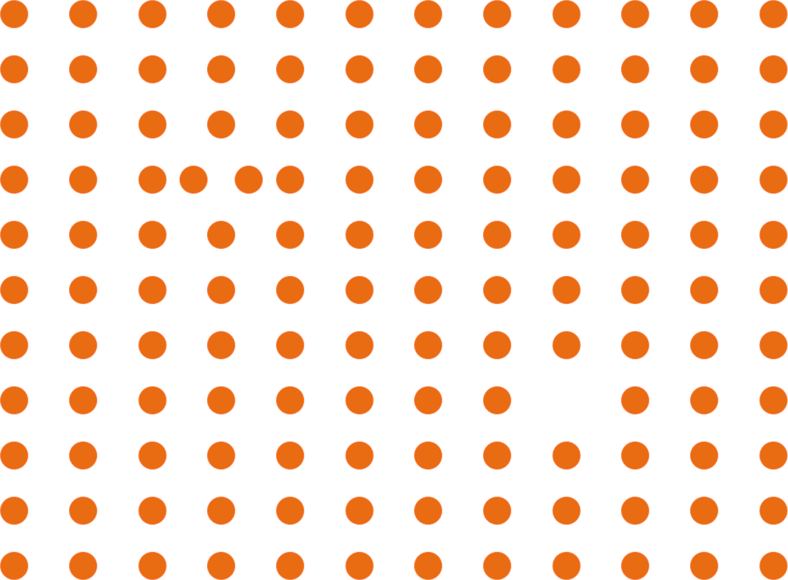
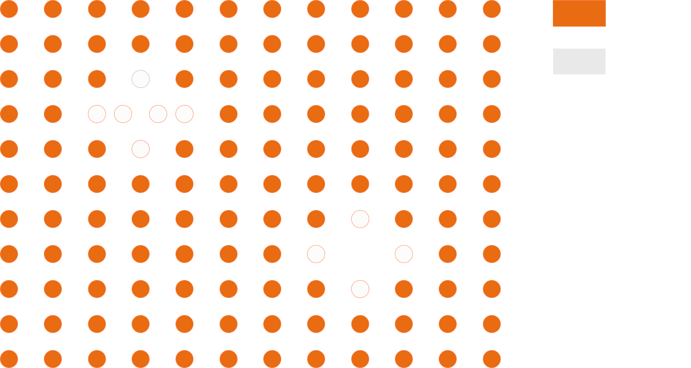
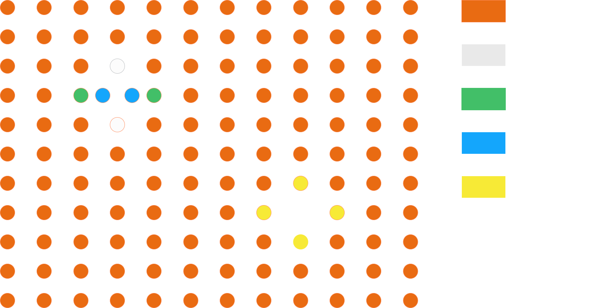
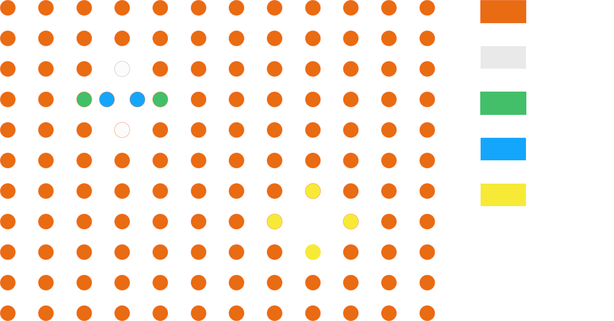
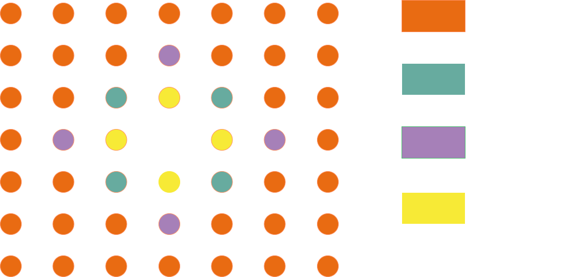
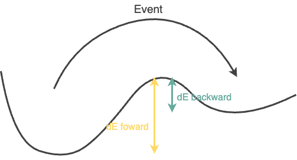

# User Guide 

This guide walks through the simulation workflow and how to choose a simulation's parameters. For the exhaustive list of every configuration field, see the [KMC Parameters](../parameters.md) reference; for a high-level description of the algorithm, see the [Algorithm Overview](../theory/general_algorithm.md). 

pyKMC is an on-the-fly kinetic Monte Carlo (KMC) program.

At each step, if a new atomic environment is encountered, pyKMC performs event searches and adds the resulting generic events to a reference event table.
When a previously visited environment is found again, pyKMC refines the stored reference events to account for elastic deformations, and builds an active event table specific to the current state.

An event is then selected from this active table based on the chosen KMC algorithm and applied to the system, advancing the simulation.

To start a simulation, pyKMC requires a configuration file in the INI format. This file contains general simulation parameters, as well as tool-specific settings needed to run the different stages of the simulation workflow. 

## Control 

The first section of the INI configuration file, called [Control], defines general simulation parameters.
You must provide an initial atomic configuration file, readable by ase.io.read, which includes atomic positions, cell parameters, and periodic boundary conditions (PBC). For example, if using an XYZ file, it should look like:

```bash 
2047
Lattice="28.16 0.0 0.0 0.0 28.16 0.0 0.0 0.0 28.16" pbc="T T T"
Ni       0.00000000       0.00000000       0.00000000       
Ni       0.00000000       1.76000000       1.76000000       
... 
``` 
The production `python -m pykmc` path currently assumes a diagonal, orthorhombic
simulation cell and full three-dimensional periodicity (`pbc="T T T"`): the
LAMMPS box is built from the three diagonal cell entries only, and the neighbor
construction applies periodic wrapping on all axes. Triclinic cells and
nonperiodic axes are not preserved.

The path to this file should be provided using the `initial_config` key. 
You must also specify:
- the number of KMC steps to run with `n_steps`
- the energy/force engine with `engine` (currently `lammps`); event search and refinement are configured separately

A minimal example of a `[Control]` section would be:
```INI 
[Control] 
initial_config = myconfig.xyz 
n_steps = 100 
engine = lammps
``` 
Additional options in this section allow you to customize output filenames (see the [KMC Parameters](../parameters.md) reference).
pyKMC also saves the reference event table and the list of visited environments as .pickle files. To reuse them in a new simulation, simply provide their paths:

```INI 
reference_table = my_reference_table.pickle 
visited_environments = my_visited_environments_list.pickle
```  
Alternatively, you may provide only a list of visited environments if you wish to exclude certain environments from being explored.

## Engine 

The INI configuration file must also include a section specific to the engine you selected in the `[Control]` section.
For example, if you set `engine = lammps`, your file should include a `[Lammps]` section.

### LAMMPS 

When using LAMMPS, you need to specify the potential parameters.
Currently, only pair potentials are supported. You must provide the `pair_style` and `pair_coeff` keys.

Additionally, you can change default parameters used during system minimization (see the [KMC Parameters](../parameters.md) reference). 

A minimal `[Lammps]` section might look like:
```INI 
[Lammps]
pair_style = eam/alloy 
pair_coeff = * * my_file.eam Ni 
``` 

## Atomic Environment 

During the simulation, at each step, pyKMC assigns an atomic environment ID to every atom in the system.
This ID serves as a unique fingerprint of the atom’s local environment, allowing pyKMC to identify recurring configurations.

Each reference event is also tagged with an environment ID, corresponding to the initial local configuration of the event’s central atom—the atom that moves the most during the transition. Reference-event IDs are always graph certificates computed around the event's most-displaced atom (see the `graph` style below).

To determine whether a stored reference event can be reused, pyKMC compares the event's environment ID with those computed in the current system.

Different ID generation strategies (called styles) are available to define atomic environments. 

To define parameters related to the generation of those IDs, the INI configuration file must contain an `[AtomicEnvironment]` section. 

The two main parameters are specified by the `rnei` and `rcut` keys. `rnei` defines the first nearest neighbors of an atom. Atoms within this distance are considered direct neighbors. `rcut` defines the local-environment sphere; atoms inside that sphere are part of the atomic environment. 

You can select the method (or style) used to assign an atomic environment ID to each atom.
The available styles are:
- cna : 
In this mode, pyKMC performs a common neighbor analysis: for every neighbor pair it computes the CNA signature (number of shared neighbors and the bonds between them) and labels the atom "crystal" when the set of signatures matches a known crystalline fingerprint (FCC/HCP, BCC, or icosahedral).
    - if the signatures match one of these fingerprints, the atom is labeled "crystal".
    - Otherwise, it is labeled "noncrystal".
This style should be only use when setting in the `[Control]` section `reconstruction = False`. (_Not working anymore for the moment_).
<div style="display: flex; align-items: center; justify-content: center; gap: 20px;">
  
  <div style="text-align: center; font-weight: bold;">
    Using style=cna gives: 
  </div>
  
</div>

- graph : 
In this style, pyKMC constructs a graph from each atom's environment using pyNauty. 
pyNauty computes a canonical certificate, which pyKMC stores as a hexadecimal string and uses as the atom’s environment ID.
<div style="display: flex; align-items: center; justify-content: center; gap: 20px;">
  
  <div style="text-align: center; font-weight: bold;">
    Using style=graph gives: 
  </div>
  
</div>

- cna/graph : 
In large systems, many atoms are in a perfect crystalline environment. Computing graph-based IDs for all of them is inefficient.
This hybrid mode provides a compromise: 
    - First, a CNA classification is performed. 
    - If an atom is labeled "crystal", it keeps this simple ID. 
    - If it is labeled "noncrystal", a graph-based ID is computed. 
<div style="display: flex; align-items: center; justify-content: center; gap: 20px;">
  
  <div style="text-align: center; font-weight: bold;">
    Using style=cna/graph gives: 
  </div>
  
</div>

- coordination : 
A simpler crystalline test based on the neighbor count alone: atoms with at least `coordination_threshold` neighbors (within `rnei`) are labeled "crystal", atoms with fewer are labeled "noncrystal". The `coordination_threshold` key is required with this style.

- coordination/graph : 
Same hybrid idea as cna/graph, but the crystalline filter is the coordination test above: "noncrystal" atoms (fewer than `coordination_threshold` neighbors) get a graph-based ID.

- diamond/graph : 
A cna/graph variant for diamond-lattice materials: the CNA fingerprint is evaluated on each atom's second-neighbor shell (which is FCC-like in the diamond structure), and graph IDs are computed for the remaining "noncrystal" atoms.

When searching for an event around a "noncrystal" atom, it may happen that another atom ends up being the one that moves the most. In this case, the resulting event will be tagged with the graph ID of that other atom.
If this ID corresponds to a "crystal" atom in the current system, that event will never be selected. 

To avoid this issue, you can instruct pyKMC to also compute graph IDs for the neighbors of "noncrystal" atoms using the `neighbors_add` key: `0` limits graph IDs to the noncrystalline atoms themselves, while any positive value additionally computes graph IDs for their immediate neighbors. (Values greater than one do not currently expand further shells.)

For example, a vacancy with `neighbors_add = 1` gives:

<div style="text-align: center;">

</div>

### Chemical species in environment matching

In alloys, the `atom_coloring_mode` key controls whether chemical species are
part of the environment fingerprint:

- `full` (**default**): element types enter the graph hashing, the point-set
  registration, and the symmetry detection. Two sites with identical geometry
  but different chemical decoration get different IDs, so events are only
  reused between chemically identical environments.
- `grey`: all atoms are treated as identical (the "grey alloy" approximation).
  Environments and event reuse are purely geometric, which yields far fewer
  unique environments (and thus fewer searches), at the cost of ignoring
  species effects on barriers.

For single-species systems the two modes are equivalent.

A typical `[AtomicEnvironment]` section is:
```INI 
[AtomicEnvironment] 
style = cna/graph
rnei = 3.0 
rcut = 6.5 
neighbors_add = 1 
``` 
## Event Search

The `[EventSearch]` section selects the saddle-search algorithm, sets the number of searches, defines catalog acceptance criteria, and configures post-refinement validation.

This section requires two mandatory keys:
- `style` : the algorithm used to perform event searches. _Currently, only partn is supported._
- `nsearch` : number of event searches to perform per atomic environment.

A minimal `[EventSearch]` section is:
```INI 
[EventSearch] 
style = partn 
nsearch = 50 
``` 

When an event is found, it is characterized by two energy barriers, a forward energy barrier $dE_{forward}$ and a backward energy barrier $dE_{backward}$ : 
<div style="text-align: center;">
  
  <div style="font-size: 0.9em; color: gray; margin-top: 5px;">
    Potential energy surface
  </div>
</div>

The event is added to the reference table only if it satisfies all the following conditions:

- $dE_{forward} \le$ `emax_event` 
- $dE_{forward} \ge$ `emin_event` 
- $dE_{backward} \ge$ `emin_event` 
- the event is not highly asymmetric: an event is rejected when
  $dE_{forward}$ > `energy_asymmetry` $\times$ `backward_emin_event` while
  $dE_{backward}$ < `backward_emin_event` 

(Equality at the bounds is accepted; rejection uses strict comparisons.)

Once a reference event is reused, it is refined to adapt to the current atomic configuration. The refinement is considered successful if:
- The central atom moves less than `refined_minimum_delr_thr` between the current position and the refined minimum.
- The difference in energy barriers between the generic and refined events is less than `refined_energy_thr`.
These thresholds ensure that the refined event remains consistent with the original.

To further control the behavior of the selected event search algorithm (style), you must define a separate section matching the algorithm name. For instance, if you choose `style = partn` you must also include a `[pARTn]` section in your INI file to configure specific parameters for the pARTn method. 

### pARTn

All other parameters have default values (see the [KMC Parameters](../parameters.md) reference), but depending on your system, you may need to adjust some of them for optimal performance.
Refinement-specific pARTn parameters use the `r_` prefix.

A minimal `[pARTn]` section is:
```INI 
[pARTn] 
delr_thr = 0.1
r_eigval_th = -0.02
```

For a detailed explanation of the pARTn algorithm and its parameters, please refer to the [official pARTn documentation](https://mammasmias.gitlab.io/artn-plugin/).

## Rate Constant 

Each time an event is added to either the reference or the active event table, a rate constant is computed. The method used to compute this rate is defined in the [RateConstant] section of the INI configuration file.

The only implemented rate style is currently `style = constant`. This method computes the rate constant using the following equation. 

$$
k = k_{0} e^{-\frac{dE_{forward}}{{k_{b}T}}}
$$
Where:
- $k$ is the rate constant,
- $k_{0}$ is a user-defined pre-exponential factor,
- $T$ is the system temperature (in Kelvin), defined by the user,
- $dE_{forward}$ is the forward energy barrier (in eV),
- $k_{b}$​ is the Boltzmann constant.

All parameters are in LAMMPS *metal* units, so **`k0` is given in
$ps^{-1}$**: a typical attempt frequency of $10^{13}\,s^{-1}$ corresponds to
`k0 = 10` (and the default `k0 = 1.0` to $10^{12}\,s^{-1}$). The physical
background of this Arrhenius form is covered in
[Transition State Theory](../theory/tst.md).

A typical section is:

```INI 
[RateConstant]
style = constant 
k0 = 10
T = 300 
``` 

## PSR 

When applying a reference event to a system for refinement, pyKMC performs a point set registration (also known as shape matching) to align the atomic positions from the reference event with the local atomic environment of the atom currently targeted for refinement.

You can define the algorithm to use with the `style` key. Currently only `ira` is implemented; `style` is the only mandatory field in `[PSR]`. 

You may also want to adjust the default value of matching_score_thr, which sets the maximum allowed matching score for a successful registration.
For `style = ira`, the matching score corresponds to the Hausdorff distance between the two point sets.

For example:
```INI 
[PSR]
style = ira 
matching_score_thr = 0.3 
``` 

As with the engine and event-search settings, you must also include a dedicated section for the selected point set registration method.

### IRA 

When using IRA, you may override its defaults. See the [KMC Parameters](../parameters.md) reference and the [IRA documentation](https://mammasmias.github.io/IterativeRotationsAssignments/) for details. 
To ensure access to default values, the section must be present in the configuration file, even if it's empty.

## Final configuration file 

Finally, based on the previous examples, a complete INI configuration file would look like this:

```INI 
[Control] 
initial_config = myconfig.xyz 
n_steps = 100 
engine = lammps

[Lammps]
pair_style = eam/alloy 
pair_coeff = * * my_file.eam Ni 

[AtomicEnvironment] 
style = cna/graph
rnei = 3.0 
rcut = 6.5 
neighbors_add = 1  

[EventSearch] 
style = partn 
nsearch = 50  

[pARTn] 
delr_thr = 0.1
r_eigval_th = -0.02

[RateConstant]
style = constant 
k0 = 10 
T = 300  

[PSR]
style = ira 
matching_score_thr = 0.3  

[IRA] 
```

## Running a simulation

Once both the input file and the initial configuration file are ready, launch the simulation by executing:

```bash 
mpirun -n 2 python -m pykmc -in <your_input_file_name> 
``` 

This is the minimum launch for the defaults (`n_sessions = 1`,
`engine_use_rank_0 = False`): rank 0 orchestrates the run and each engine
session needs its own rank, so pyKMC always requires an MPI launch. See
[Parallelization](parallelization.md) before choosing a larger rank count to
speed up event searches and refinements with multiple LAMMPS instances.
