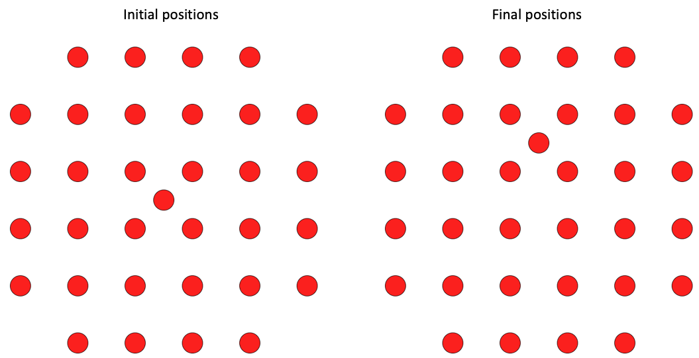
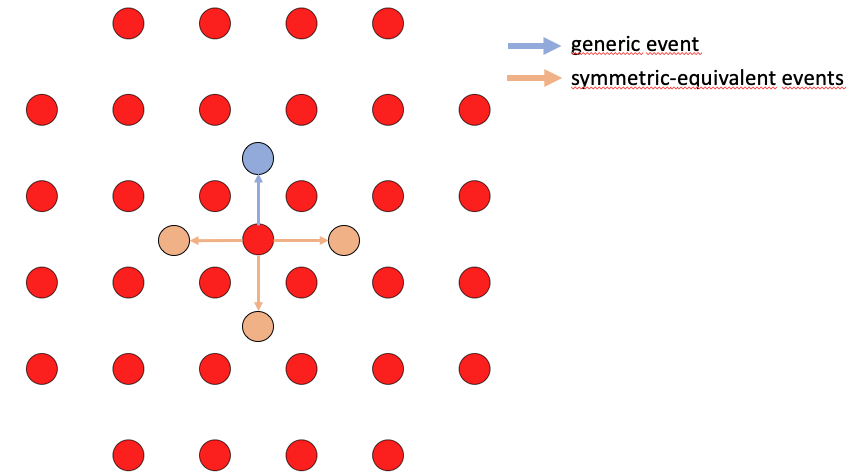

# Symmetries
When a generic event is found, a Pandas Series is created containing, among other information, the initial and final positions of the event.

  

To determine all symmetry-equivalent events:

  

We use SOFI, a module from the IRA library, which provides all the symmetry operations of the atomic structure corresponding to the initial positions. After calling SOFI, we obtain an object that includes both the symmetry matrices and the associated permutation matrices.

Among the symmetry operations found, some are not relevant (e.g., the identity operation), or are redundant (e.g., a reflection and a rotation leading to the same transformation). For instance, in this example, 16 symmetry operations are returned.

To identify the unique symmetries, we compute the displacement matrix between initial and final positions and store them in a list, `unique_displacements`. We also initialize an empty list, `unique_symmetries`, to store unique symmetry operations.

Each symmetry operation provided by SOFI is then applied to the displacement matrix. If the resulting displacement matrix is not already in `unique_displacements` (checked using `numpy.allclose()`), it is added to the list, and the corresponding symmetry operation is stored in `unique_symmetries`.

Finally, the symmetry matrices and the permutation matrices associated with the unique symmetries are saved as columns in the Pandas Series.

These matrices will later be used during the refinement step to construct specific events.

_Note: These operations are implemented in symmetries.py_